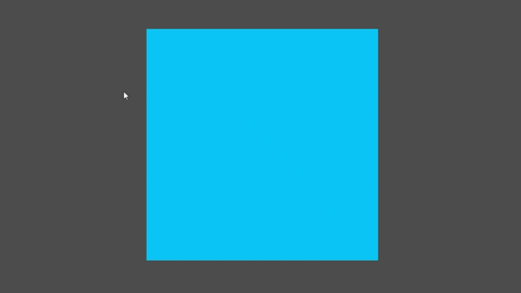

# Example of DX11 and Vulkan interoperation in Godot

This project is a demo of DX11 library integration in Godot engine with Vulkan backend.

It consists of two parts: 
- DX11App which is a dummy DX11 application that creates shared texture and constantly updates it with different colours
- Dx11TextureView which is Godot extension which though native Vulkan methods reads shared texture and assigns it to Sprite2D

# ATTENTION
THIS IS NOT PRODUCTION CODE! MEMORY WILL BE LEAKING AND GODOT MAY BE CRASHING!
CODE AUTHOR IS PYTHON DEVELOPER AND WRITES C++ CODE FIRST TIME IN HIS LIFE!

## Prerequisites

To use this on your machine, you will need the following:

- (!!!!!IMPORTANT!!!!) rebuild godot with following extensions in vulkan_context.cpp enabled:
```
	register_requested_device_extension(VK_KHR_EXTERNAL_MEMORY_WIN32_EXTENSION_NAME, true);
	register_requested_device_extension(VK_KHR_BIND_MEMORY_2_EXTENSION_NAME, true);
	register_requested_device_extension(VK_KHR_DEDICATED_ALLOCATION_EXTENSION_NAME, true);
	register_requested_device_extension(VK_KHR_GET_MEMORY_REQUIREMENTS_2_EXTENSION_NAME, true);
```
- install **[CMake](https://cmake.org/)** v3.22+
- C++ Compiler with at least **C++17** support (any recent compiler)


Run cmake to generate VS project:
```
cmake . -DCMAKE_BUILD_TYPE=Debug
```

Open GDDx11InteropDemo.sln and compile dll.


Open project/ with modified godot binary and you will see sprite that slowly changes color.



